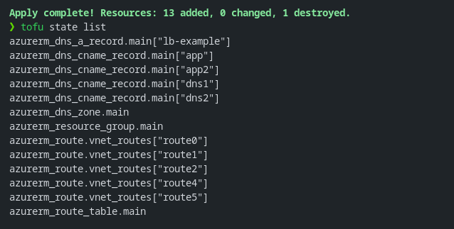

# 🧾Guia Prático: Usando Arquivos CSV no OpenTofu

## Intro 

Há pessoas que têm um amor incontrolável por planilhas. Pois é… acabei me envolvendo nesse mundo também. Desde que comecei a trabalhar com *infraestrutura como código*, sempre procurei formas de automatizar tarefas repetitivas e agilizar processos, e, durante esse caminho de transiçaõ de controles por fora do código, estavam em planilhas, e as opções que eu estava trabalhando era muito verboso, mesmo reutilizando código não era prático como ler uma planilha.

Foi aí que, há alguns anos, descobri que o [OpenTofu](https://opentofu.org/) permite integrar arquivos CSV diretamente com o Terraform. A ideia é simples: usar listagens em formato `.csv` (como as que usamos pra inventariar regras de firewall, DNS, ou rotas de rede) e automatizar a criação desses recursos.

Neste guia, vou mostrar como você pode usar dados de um CSV para criar **rotas em uma Route Table** e **entradas de DNS**, de maneira fácil e replicável.

Todos os exemplos estão disponíveis no repositório [github.com/drylabs/posts](https://github.com/Gustavmk/drylabs-site-examples/tree/tofu-plus-csv/tf/tofu-plus-csv).


## 📁Exemplo 1 – Criando Entradas na Route Table com CSV

Antes de tudo, vamos criar o nosso arquivo CSV chamado `vnet_routes.csv`, com as colunas necessárias:

```csv
route_name,address_prefix,next_hop_type,next_hop_ip
route0,1.1.1.1/32,Internet,null
route1,1.1.1.2/32,VirtualNetworkGateway,null
route2,1.1.1.3/32,VnetLocal,null
route4,1.1.1.4/32,None,null
route5,1.1.1.5/32,VirtualAppliance,10.0.0.1
```

> 💡Esse arquivo precisa estar no diretório raiz do seu módulo tf

- Armazenando informação em um Local

Local value que define o nome *vnet_routes*, onde podemos relacionar diversas novas vezes a partir dele.
O arquivo CSV precsia ser armazenado a partir do diretório raiz do modulo em referência.

```terraform
locals {
  vnet_routes = csvdecode(file("${path.module}/vnet_routes.csv"))
}
```

- Aplicar excelll
1. This is a for_each loop that references the CSV file from the local value.
  - I've also set it to assign a key of the route_name (from the CSV file) to each route, making a map (key/value pair) of the data.
  - This lets me change or destroy routes without having to re-create all of the routes, as you would with a list.
2. Cada linha do csv entra no laço definido por *função* 'each.value.' + coluna do csv.
3. Ternário. Função condicional que validará caso o tipo definido da coluna seja "VirtualAppliance". Quais são as possiveis condições:
   - Caso 1: Se "virtualAppliance" for verdadeiro, então ele definirá o next hop definido na ultima coluna do csv
   - Caso 2: Se "virtualAppliance" for False, então não haverá a configuraçõ da regra de Next Hop na rota.  
   
```terraform
resource "azurerm_route" "vnet_routes" {

  # 1
  for_each               = { for routes in local.vnet_routes : routes.route_name => routes }

  # 2
  name                   = each.value.route_name
  resource_group_name    = each.value.resource_group_name
  route_table_name       = each.value.route_table_name
  address_prefix         = each.value.address_prefix
  next_hop_type          = each.value.next_hop_type

  # 3
  next_hop_in_ip_address = (each.value.next_hop_type == "VirtualAppliance") == true ? each.value.next_hop_in_ip_address : null

}
```


## Exemplo 2 - Criando entradas de DNS usando locals para definir um valor csv sem ter um arquivo csv no repositório


### 🔍 O que está acontecendo aqui?

## ✅Resultado final 

Para aplicar o código acima, foi utilizado o `tofu init, tofu plan -out tfplan e tofu apply "tfplan"`.

Todas as rotas e registros DNS definidos nas planilhas serão criados automaticamente.




🧠Dicas Úteis

- ✅Prefira for_each ao invés de count: O for_each funciona melhor que count quando os dados são baseados em mapas. Isso possibilita uma fácil manutenção, pois a remoção de uma entrada não afetará no ciclo de vida dos demais recursos.
- 🧩Campos opcionais (como o next_hop_ip) podem ser tratados com ternários, como mostrado acima.
- 🗃️Padronize os cabeçalhos do CSV: mantenha os nomes simples e sem espaços para facilitar o uso direto nas expressões each.value.


📚 Referências

- [Tofu - csvdecode()](https://opentofu.org/docs/language/functions/csvdecode/)
- [Tofu - for_each](https://opentofu.org/docs/language/meta-arguments/for_each/)
- [Tofu - Ternário / Conditional Expressions](https://opentofu.org/docs/language/expressions/conditionals/)
