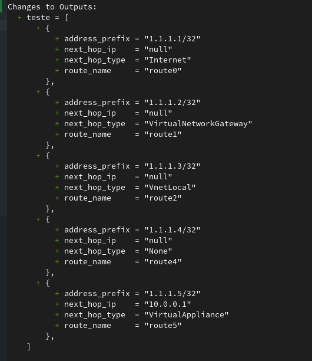

# Guia Prático: Usando Arquivos CSV no OpenTofu

**Terraform / OpenTF/OpenTofu**: O que será debatido aqui, vou denominar simplesmente como Tofu e ponto. 

> **Nota:** O OpenTofu é um fork do Terraform, e o nome "OpenTofu" foi escolhido para refletir a natureza aberta e colaborativa do projeto. O OpenTofu é uma versão do Terraform que é mantida por uma comunidade de desenvolvedores e usuários, e é projetada para ser compatível com o Terraform original, mas com um foco maior em recursos abertos e transparência.
>
> [The openTofu Manifesto](https://opentofu.org/manifesto/)


## Introdução 

Há pessoas que têm um amor incontrolável por planilhas. Pois é… acabei me envolvendo nesse mundo também. Desde que comecei a trabalhar com *infraestrutura como código* (IaC), sempre procurei formas de automatizar tarefas repetitivas e agilizar processos, e, durante esse caminho de transiçaõ de controles por fora do código, estavam em planilhas, e as opções que eu estava trabalhando era muito verboso, mesmo reutilizando código não era prático como ler uma planilha.

Foi aí que, há alguns anos, descobri que o [OpenTofu](https://opentofu.org/) permite integrar arquivos CSV diretamente com o Terraform. A ideia é simples: usar listagens em formato `.csv` (como as que usamos pra inventariar regras de firewall, DNS, ou rotas de rede) e automatizar a criação desses recursos.

Neste guia, vou mostrar como você pode usar dados de um CSV para criar **rotas em uma Route Table** e **entradas de DNS**, de maneira fácil e replicável.

Todos os exemplos estão disponíveis no repositório **[github.com/drylabs/posts](https://github.com/drylabs/code-examples/tree/main/tf/tofu-plus-csv)**.

No final desse artigo você aprenderá a consumir CSV usando o Tofu para declarar sua infraestrutura como código em seus projetos. 


## Porque CSVs são mais elegantes do que list(maps) tradicionais no Terraform

No Tofu, uma estrutura muito útil para modelar dados complexos é o tipo **list maps** — ou seja, uma lista onde cada item é um mapa (dicionário) com chaves e valores. 

Tradicionalmente, você poderia definir uma lista de mapas assim:

### Exemplo de uma lista de mapas. 

Vamos entender melhor como trabalhar com isso com o exemplo abaixo.

```hcl
variable "dns_records" {
  type = list(object({
    name  = string
    type  = string
    value = string
  }))

  default = [
    {
      name  = "www"
      type  = "A"
      value = "192.168.0.1"
    },
    {
      name  = "api"
      type  = "CNAME"
      value = "api.example.com"
    }
  ]
}
```
O que acontece nesse exemplo, é que você já utilizou três linhas de código para definir apenas um registro dentro do list(map). Agora, imagine que você tenha 100 registros DNS para criar. Você teria que repetir esse padrão 100 vezes, sinigicando n * 3, totalizando 300 linhas. Essa é uma situação que você poderá enfrentar caso não utilize o CSV.

Comma-Separated Values (CSV) é um formato de arquivo que armazena dados tabulares em texto simples. Ele é amplamente utilizado para transferir dados entre diferentes sistemas e aplicativos, especialmente em planilhas e bancos de dados.

Essa estrutura é perfeitamente representada também por tabelas e planilhas. Os arquivos no formato CSV, podem ser automaticamente convertidos para esse formato com a função *`csvdecode()`* que iremos explorar logo abaixo em duas formas de aplicar em seu projeto. 

### Porque isso importa?

- **Simplicidade**: Com o CSV, você pode ter todos os seus dados em um único arquivo, facilitando a leitura e a manutenção.
- **Flexibilidade**: Você pode facilmente adicionar, remover ou modificar entradas no CSV sem precisar alterar o código do Terraform.
- **D.R.Y**: Don't repeat yourself! Você pode usar o mesmo arquivo CSV em diferentes módulos ou projetos, tornando seu código mais modular e reutilizável.

## Exemplo 1 – Criando Entradas na Route Table com CSV

Antes de tudo, vamos criar o nosso arquivo CSV chamado `vnet_routes.csv`, com as colunas necessárias:

```csv
route_name,address_prefix,next_hop_type,next_hop_ip
route0,1.1.1.1/32,Internet,null
route1,1.1.1.2/32,VirtualNetworkGateway,null
route2,1.1.1.3/32,VnetLocal,null
route4,1.1.1.4/32,None,null
route5,1.1.1.5/32,VirtualAppliance,10.0.0.1
```

> 💡Esse arquivo precisa estar no diretório raiz do seu módulo tf

O *Local* será responsável por definir o valor *vnet_routes*, onde podemos relacionar diversas novas vezes a partir dele.
O arquivo CSV precsia ser armazenado a partir do diretório raiz do modulo em referência.

Para transformar a listagem acima no formato CSV. Utilizaremos a função *`csvdecode()`*. Dessa forma, o Tofu criará uma list(map(string)) automaticamente. 

Para fins de demonstração, criei um output para demonstrar o resultado após a conversão do CSV.

```hcl
locals {
  vnet_routes = csvdecode(file("${path.module}/vnet_routes.csv"))
}

output "vnet_routes" {
  value = local.vnet_routes
}
```
|  | 
|:--:| 
| *Exemplo Tofu output de csv para string(map)* |


#### Iteração da lista

Após a definição dos nossos valores na string(map), faremos o consumo dela no bloco de recurso que declararemos a route table. 

```hcl
resource "azurerm_route" "vnet_routes" {
  for_each            = { for routes in local.vnet_routes : routes.route_name => routes } 

  route_table_name    = azurerm_route_table.main.name
  resource_group_name = azurerm_resource_group.main.name

  name                   = each.value.route_name
  address_prefix         = each.value.address_prefix
  next_hop_type          = each.value.next_hop_type
  
  next_hop_in_ip_address = (each.value.next_hop_type == "VirtualAppliance") == true ? each.value.next_hop_ip : null
}
```

### 🔍 O que está acontecendo?

Para ajudar no entendimento, vamos analisar os principais trechos desse código. 

#### Expressão for_each

`for_each = { for routes in local.vnet_routes : routes.route_name => routes }`

Nessa parte o OpenTofu itera sobre os dados do local.vnet_routes. Desta forma, é criado um mapa usando route_name como chave. Assim, cada rota será gerenciada de forma independente. Iremos observar esse comportamento mais adiante, após a aplicação do código.

#### Expressão ternária

`next_hop_in_ip_address = (each.value.next_hop_type == "VirtualAppliance") == true ? each.value.`

  - Se next_hop_type for "VirtualAppliance", o IP de próximo salto (next_hop_ip) será usado.
  - Caso contrário, o campo será null.

## Exemplo 2 - Criando entradas de DNS usando locals para definir um valor csv sem ter um arquivo csv no repositório

Esse exemplo é semelhante ao anterior, mas aqui não utilizamos um arquivo CSV. Em vez disso, definimos os valores diretamente no código usando `Heredoc Strings`.

```hcl
locals {

  csv_dns_zone_type_cname_drylabs_dev = <<-CSV
    name,type,ttl,records,docs
    dns1,CNAME,3600,drylabs.dev,n/a
    dns2,CNAME,3600,google.com,n/a
    app,CNAME,3600,lb-example.drylabs.dev,n/a
    app2,CNAME,3600,app2.drylabs.dev.cdn.cloudflare.net,n/a
  CSV

  csv_dns_zone_type_a_drylabs_dev = <<-CSV
    name,type,ttl,records,docs
    lb-example,a,3600,1.1.1.1,n/a
  CSV

  dns_zone_type_cname_drylabs_dev = csvdecode(local.csv_dns_zone_type_cname_drylabs_dev)
  dns_zone_type_a_drylabs_dev     = csvdecode(local.csv_dns_zone_type_a_drylabs_dev)
}
```

- 🔍 Nesse exemplo estamos definindo em locals duas listas separadas. A primeira lista *csv_dns_zone_type_cname_drylabs_dev*, para finalidade de registros como CNAME e a segunda lista *csv_dns_zone_type_a_drylabs_dev* para tipos de registro A. Nesse etapa não estão codificadas como csv, porém contem todo o conteúdo necessário para serem consumidas como CSV.
- 🔍 Ainda em *locals*, os valores *dns_zone_type_cname_drylabs_dev e dns_zone_type_a_drylabs_dev* são definidos como `csvdecode()`, respectivamente. Isso converte as strings em listas de mapas, permitindo o acesso aos dados de forma mais fácil.

#### Iteração da lista

Nesse momento, repetimos a mesma lógica utilizada no exemplo 1.

```hcl
resource "azurerm_dns_a_record" "main" {
  for_each            = { for k in local.dns_zone_type_a_drylabs_dev : k.name => k }
  zone_name           = azurerm_dns_zone.main.name
  resource_group_name = azurerm_resource_group.main.name

  name    = each.value.name
  records = [each.value.records]
  ttl     = each.value.ttl
}
```

### ✅Resultado final 

Para aplicar o código acima, foi utilizado o `tofu init, tofu plan -out tfplan e tofu apply "tfplan"`.

Todas as rotas e registros DNS definidos nas planilhas serão criados automaticamente. Reutilizando o msemo trecho de código para criar entradas de DNS e rotas, você pode facilmente adicionar ou remover entradas no CSV sem precisar alterar o código do Tofu.

Além disso nesse exemplo não estamos fazendo uso de modulos, possibilitando reduzir ainda mais a complexidade do código e reduzindo o numero de repetições de código. Entretanto, não é a finalidade desse post.

|  | 
|:--:| 
| *Provisionamento dos recursos baseado em listas* |

Chegamos ao final do nosso guia prático. Agora você tem uma compreensão sólida de como usar arquivos CSV no OpenTofu para criar e gerenciar recursos de forma eficiente.

## 🧠Dicas úteis e referencias

- ✅Prefira **for_each** ao invés de **count**: O **for_each** funciona melhor que **count** quando os dados são baseados em mapas. Isso possibilita uma fácil manutenção, pois a remoção de uma entrada não afetará no ciclo de vida dos demais recursos.
- 🧩Campos opcionais - *como o next_hop_ip do primeiro exemplo* - podem ser tratados com ternários.
- 🗃️Padronize os cabeçalhos do CSV: mantenha os nomes simples e sem espaços para facilitar o seu uso direto nas expressões each.value.


### 📚 Referências

- [OpenTofu - csvdecode()](https://opentofu.org/docs/language/functions/csvdecode/)
- [OpenTofu - for_each](https://opentofu.org/docs/language/meta-arguments/for_each/)
- [OpenTofu - Ternário / Conditional Expressions](https://opentofu.org/docs/language/expressions/conditionals/)
- [OpenTofu - Heredoc Strings ](https://opentofu.org/docs/language/expressions/strings/#indented-heredocs)
- [DRY Coding with Terraform](https://jloudon.com/cloud/HashiTalks-ANZ-DRY-Coding-with-Terraform-CSVs-ForEach/)
- 
