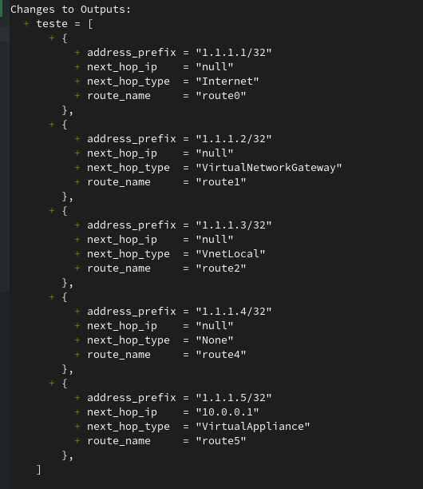
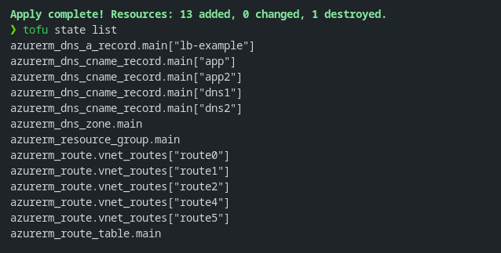

# Practical Guide: Using CSV Files in OpenTofu

**Terraform / OpenTF/OpenTofu**: What I'll discuss here, I'll simply call Tofu and that's it.

> **Note:** OpenTofu is a fork of Terraform, and the name "OpenTofu" was chosen to reflect the open and collaborative nature of the project. OpenTofu is a version of Terraform maintained by a community of developers and users, designed to be compatible with the original Terraform, but with a greater focus on open resources and transparency.
>
> [The openTofu Manifesto](https://opentofu.org/manifesto/)


## Introduction

There are people who have an uncontrollable love for spreadsheets. Well... I ended up getting involved in this world too. Since I started working with *Infrastructure as Code* (IaC), I've always looked for ways to automate repetitive tasks and streamline processes. During this transition of moving controls out of code, they were in spreadsheets, and the options I was working with were very verbose. Even reusing code wasn't as practical as reading a spreadsheet.

That's when, a few years ago, I discovered that [OpenTofu](https://opentofu.org/) allows you to integrate CSV files directly with Terraform. The idea is simple: use listings in `.csv` format (like those we use to inventory firewall rules, DNS, or network routes) and automate the creation of these resources.

In this guide, I'll show you how to use data from a CSV to create **routes in a Route Table** and **DNS entries**, in an easy and replicable manner.

All examples are available in the **[github.com/drylabs/posts](https://github.com/drylabs/code-examples/tree/main/tf/tofu-plus-csv)** repository.

By the end of this article, you'll learn how to consume CSV using Tofu to declare your infrastructure as code in your projects. 

## Why CSVs are More Elegant Than Traditional list(objects) in Terraform

In Tofu, a very useful structure for modeling complex data is the **list of objects** type — that is, a list where each item is a map (dictionary) with keys and values.

Traditionally, you could define a list of objects similar to the model below.

```hcl
variable "dns_records" {
  type = list(object({
    name  = string
    type  = string
    value = string
  }))

  default = [
    {
      name  = "www"
      type  = "A"
      value = "192.168.0.1"
    },
    {
      name  = "api"
      type  = "CNAME"
      value = "api.example.com"
    }
  ]
}
```
> Let's better understand how to work with this using the example below.

What happens in this example is that you've already used three lines of code to define just one record within the *string(object)*. Now imagine you have 100 DNS records to create. You'd have to repeat this pattern 100 times, meaning n * 3, totaling 300 lines. This is a situation you could face if you don't use CSV.

Comma-Separated Values (CSV) is a file format that stores tabular data in plain text. It is widely used for transferring data between different systems and applications, especially in spreadsheets and databases.

This structure is perfectly represented by tables and spreadsheets as well. CSV files can be automatically converted to this format using the *`csvdecode()`* function, which we'll explore below in two ways to apply in your project. 

### Why Does This Matter?

- **Simplicity**: With CSV, you can have all your data in a single file, making it easier to read and maintain.
- **Flexibility**: You can easily add, remove, or modify entries in the CSV without needing to change your Terraform code.
- **D.R.Y**: Don't repeat yourself! You can use the same CSV file across different modules or projects, making your code more modular and reusable.

## Example 1 – Creating Route Table Entries with CSV

First, let's create our CSV file called `vnet_routes.csv`, with the necessary columns:

```csv
route_name,address_prefix,next_hop_type,next_hop_ip
route0,1.1.1.1/32,Internet,null
route1,1.1.1.2/32,VirtualNetworkGateway,null
route2,1.1.1.3/32,VnetLocal,null
route4,1.1.1.4/32,None,null
route5,1.1.1.5/32,VirtualAppliance,10.0.0.1
```

> 💡 This file needs to be in the root directory of your tf module

The *Local* will be responsible for defining the *vnet_routes* value, where we can reference it multiple times.
The CSV file must be stored from the root directory of the module in question.

To transform the listing above into CSV format, we'll use the *`csvdecode()`* function. This way, Tofu will automatically create a list of objects.

For demonstration purposes, I created an output to show the result after the CSV conversion.

```hcl
locals {
  vnet_routes = csvdecode(file("${path.module}/vnet_routes.csv"))
}

output "vnet_routes" {
  value = local.vnet_routes
}
```
|               |
| :--------------------------------------------: |
| *Example Tofu output from csv to list(object)* |


#### List Iteration

After defining our values in the list(object), we'll consume it in the resource block where the route table was declared. 

```hcl
resource "azurerm_route" "vnet_routes" {
  for_each            = { for routes in local.vnet_routes : routes.route_name => routes } 

  route_table_name    = azurerm_route_table.main.name
  resource_group_name = azurerm_resource_group.main.name

  name                   = each.value.route_name
  address_prefix         = each.value.address_prefix
  next_hop_type          = each.value.next_hop_type
  
  next_hop_in_ip_address = (each.value.next_hop_type == "VirtualAppliance") == true ? each.value.next_hop_ip : null
}
```

### 🔍 What's Happening?

To help with understanding, let's analyze the main parts of this code.

#### for_each Expression

`for_each = { for routes in local.vnet_routes : routes.route_name => routes }`

In this part, OpenTofu iterates over the local.vnet_routes data. This way, a map is created using route_name as the key. Thus, each route will be managed independently. We'll observe this behavior later, after applying the code.

#### Ternary Expression

`next_hop_in_ip_address = (each.value.next_hop_type == "VirtualAppliance") == true ? each.value.`

  - If next_hop_type is "VirtualAppliance", the next hop IP (next_hop_ip) will be used.
  - Otherwise, the field will be null.

## Example 2 - Creating DNS Entries Using Locals to Define a CSV Value Without a CSV File in the Repository

This example is similar to the previous one, but here we don't use a CSV file. Instead, we define the values directly in the code using `Heredoc Strings`.

```hcl
locals {

  csv_dns_zone_type_cname_drylabs_dev = <<-CSV
    name,type,ttl,records,docs
    dns1,CNAME,3600,drylabs.dev,n/a
    dns2,CNAME,3600,google.com,n/a
    app,CNAME,3600,lb-example.drylabs.dev,n/a
    app2,CNAME,3600,app2.drylabs.dev.cdn.cloudflare.net,n/a
  CSV

  csv_dns_zone_type_a_drylabs_dev = <<-CSV
    name,type,ttl,records,docs
    lb-example,a,3600,1.1.1.1,n/a
  CSV

  dns_zone_type_cname_drylabs_dev = csvdecode(local.csv_dns_zone_type_cname_drylabs_dev)
  dns_zone_type_a_drylabs_dev     = csvdecode(local.csv_dns_zone_type_a_drylabs_dev)
}
```

- 🔍 In this example we're defining two separate lists in locals. The first list *csv_dns_zone_type_cname_drylabs_dev*, for CNAME record purposes, and the second list *csv_dns_zone_type_a_drylabs_dev* for A record types. At this stage they're not encoded as csv, but they contain all the necessary content to be consumed as CSV.
- 🔍 Still in *locals*, the values *dns_zone_type_cname_drylabs_dev* and *dns_zone_type_a_drylabs_dev* are defined as `csvdecode()`, respectively. This converts the strings into lists of objects, allowing easier access to the data.

#### List Iteration

At this point, we repeat the same logic used in example 1.

```hcl
resource "azurerm_dns_a_record" "main" {
  for_each            = { for k in local.dns_zone_type_a_drylabs_dev : k.name => k }
  zone_name           = azurerm_dns_zone.main.name
  resource_group_name = azurerm_resource_group.main.name

  name    = each.value.name
  records = [each.value.records]
  ttl     = each.value.ttl
}
```

### ✅ Final Result

To apply the code above, we used `tofu init, tofu plan -out tfplan` and `tofu apply "tfplan"`.

All routes and DNS records defined in the spreadsheets will be created automatically. By reusing the same code snippet to create DNS entries and routes, you can easily add or remove entries in the CSV without needing to modify the Tofu code.

Additionally, in this example we're not using modules, allowing us to reduce code complexity even further and reduce code repetition. However, that's not the purpose of this post.

|                |
| :------------------------------------: |
| *Resource provisioning based on lists* |

We've reached the end of our practical guide. Now you have a solid understanding of how to use CSV files in OpenTofu to create and manage resources efficiently.

## 🧠 Tips and Known Issues

- ✅ Prefer **for_each** instead of **count**. The **for_each** function works better when any change introduces or removes objects. It will improve maintainability lifecycle and reduce blast radius.
- 🧩 Optional fields - *like the next_hop_ip from the first example* - can be handled with ternary expressions.
- 🗃️ Standardize CSV headers: keep names simple and without spaces to make it easier to use directly in each.value expressions.


### 📚 References

- [OpenTofu - csvdecode()](https://opentofu.org/docs/language/functions/csvdecode/)
- [OpenTofu - for_each](https://opentofu.org/docs/language/meta-arguments/for_each/)
- [OpenTofu - Ternary / Conditional Expressions](https://opentofu.org/docs/language/expressions/conditionals/)
- [OpenTofu - Heredoc Strings ](https://opentofu.org/docs/language/expressions/strings/#indented-heredocs)
- [DRY Coding with Terraform](https://jloudon.com/cloud/HashiTalks-ANZ-DRY-Coding-with-Terraform-CSVs-ForEach/)
